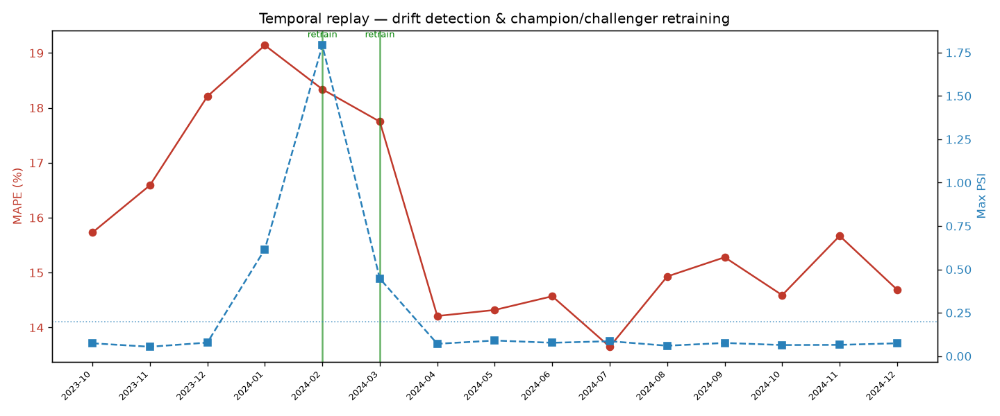

# 🎮 Steam Player-Count Forecaster — an End-to-End MLOps System

Predict a game's **next-day peak concurrent players**, and — the actual point of the project —
**serve it from a model registry, monitor it for drift in production, and retrain it
automatically when a challenger beats the champion.** Not a notebook that ends at `.predict()`.



*The whole MLOps story in one chart: stable performance → concept drift spikes PSI past the
threshold → the champion/challenger gate retrains only when a challenger beats the incumbent →
error recovers and drift settles.*

---

## What this demonstrates

| Capability | How |
|---|---|
| **Reproducible training** | Time-based split (no leakage), experiment tracking in **MLflow** |
| **Model registry as source of truth** | Model registered with a `@champion` **alias**; the API serves whatever is `@champion` |
| **Data validation** | **Pandera** schema contract fails loudly on bad data |
| **Serving** | **FastAPI** `/predict` with Pydantic validation; loads the model *from the registry* |
| **Drift detection** | **PSI** (log-scale, recent-window reference) with a per-feature report |
| **Automated retraining** | **Champion/challenger gate** — promotes only when the challenger wins on held-out data |
| **Monitoring artifact** | The temporal-replay simulation above |
| **Tests + CI** | pytest suite incl. a **model-quality eval gate**, run in GitHub Actions |
| **The living system** | Scheduled **Steam-API collector** commits fresh data back to the repo |
| **Reproducible deploy** | **Docker** image trains + serves; free-tier hosting |

Everything runs **free** and offline on a synthetic data generator; drop in a real Kaggle
"Steam concurrent players" CSV (`data/raw/*.csv`) and it's used automatically, zero code changes.

---

## Quickstart

```bash
python -m venv .venv
# Windows:  .venv\Scripts\activate      |  macOS/Linux:  source .venv/bin/activate
pip install -r requirements.txt

python -m src.train                     # train, validate, register model (@champion), freeze drift reference
uvicorn api.main:app --reload           # serve API; open http://127.0.0.1:8000/docs
streamlit run dashboard.py              # dashboard; open http://127.0.0.1:8501
```

### Example prediction

```bash
curl -X POST http://127.0.0.1:8000/predict -H "Content-Type: application/json" -d "{
  \"recent_players\": [12000,12500,11800,13000,12700,12400,12900],
  \"day_of_week\": 5, \"days_since_release\": 420, \"genre\": \"shooter\"
}"
```

---

## Monitoring, retraining & the collector

```bash
python -m src.replay        # temporal-replay simulation -> reports/replay.png
python -m src.check_drift   # PSI drift vs the frozen reference (exits non-zero on drift)
python -m src.collect       # pull live player counts from the free Steam API -> data/collected.parquet
mlflow ui --backend-store-uri sqlite:///mlflow.db   # browse runs/registry at http://127.0.0.1:5000
```

The **living system** runs on GitHub Actions crons (`.github/workflows/`): `collect.yml` pulls
fresh player counts every few hours and commits them back to the repo; `retrain.yml` retrains on
a schedule. So the project keeps collecting data and improving after it's deployed.

---

## Tests & CI

```bash
pip install -r requirements-dev.txt
pytest -q
```

`ci.yml` runs the suite on every push/PR, including a **model-quality eval gate** that fails the
build if the model regresses below a naive "same-as-yesterday" baseline — so a bad model can't merge.

---

## Docker & deploy

```bash
docker build -t steam-player-mlops .        # trains + registers the model inside the image
docker run -p 8000:8000 steam-player-mlops  # serves at http://127.0.0.1:8000
```

Deploy free: the **API** image to Render / Fly.io / Hugging Face Spaces; the **dashboard** to
Streamlit Community Cloud (`streamlit run dashboard.py`).

---

## Layout

```
config.py            # single source of truth: paths, games/date window, FEATURE_COLUMNS, drift settings
src/data.py          # real-CSV loader + synthetic panel generator (lifecycles, seasonality, drift injection)
src/validation.py    # Pandera schema — the data contract
src/features.py      # feature engineering shared by train AND serve (no train/serve skew)
src/train.py         # time-based split, MLflow logging + registry, freezes the drift reference
src/monitoring.py    # PSI drift detection
src/replay.py        # temporal-replay simulation -> reports/replay.png
src/check_drift.py   # standalone drift check for the scheduled monitor (exit-1 on drift)
src/collect.py       # Steam Web API collector (the living-system ingestion)
api/main.py          # FastAPI /predict + /health, loads the @champion model from the registry
dashboard.py         # Streamlit dashboard (live prediction + drift status + replay chart)
tests/               # pytest suite incl. the model-quality eval gate
.github/workflows/   # ci.yml (tests), retrain.yml (scheduled retrain), collect.yml (living collector)
Dockerfile           # reproducible serving image
```

---

## Design decisions & trade-offs

- **Manual PSI over Evidently** — Evidently's API churns and can be install-fragile; hand-rolled
  PSI is robust, dependency-light, and shows the drift *math*. Evidently is an easy drop-in later
  for richer HTML reports.
- **MLflow aliases over stages** — MLflow 3 deprecated `Staging`/`Production` stages; a `@champion`
  alias is current best practice and makes promotion a one-line alias move, no redeploy.
- **Registry as source of truth** — the API serves whatever is `@champion` (local joblib only as a
  fallback), so retraining promotes a model without touching serving code.
- **Naive baseline in the eval gate** — next-day counts are highly autocorrelated, so the model is
  benchmarked against "same as yesterday"; the gate ensures it actually earns its keep.
- **Synthetic generator that can inject drift** — lets the whole pipeline run free/offline *and*
  gives controlled drift to test the monitor against known ground truth.

Full build plan and rationale: [`../MLOPS_PROJECT_ROADMAP.md`](../MLOPS_PROJECT_ROADMAP.md).
